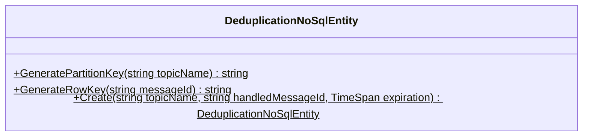
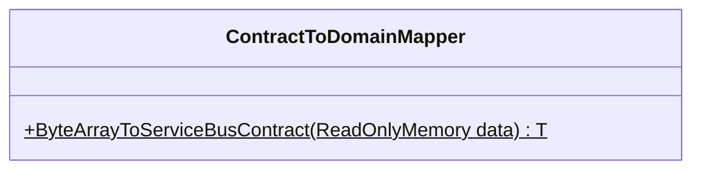
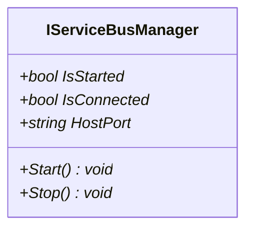
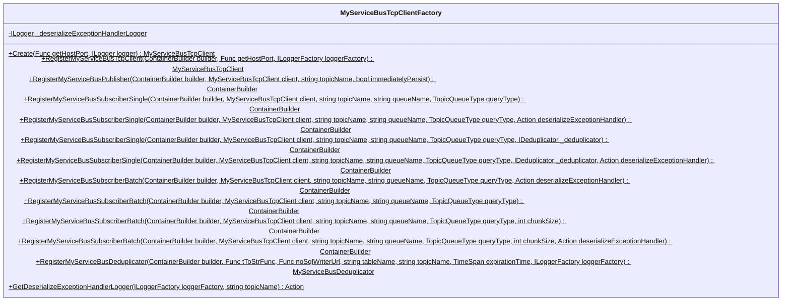
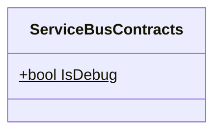
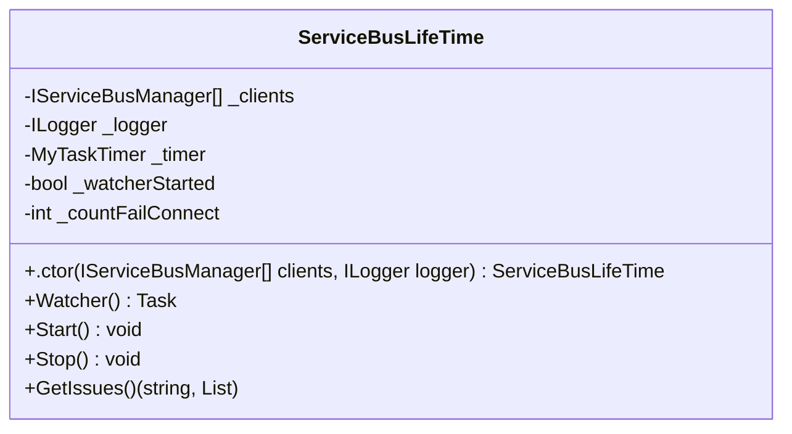
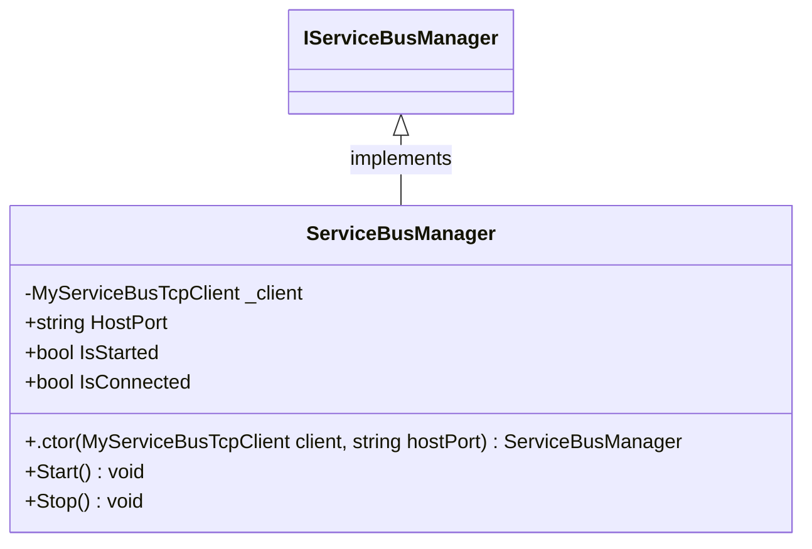
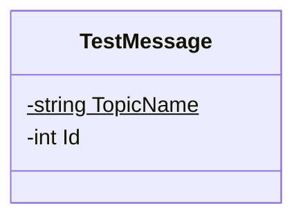

<!-- markdownlint-capture -->
<!-- markdownlint-disable -->

# Code Metrics

This file is dynamically maintained by a bot, *please do not* edit this by hand. It represents various [code metrics](https://aka.ms/dotnet/code-metrics), such as cyclomatic complexity, maintainability index, and so on.

<div id='myjetwallet-sdk-servicebus'></div>

## MyJetWallet.Sdk.ServiceBus :warning:

The *MyJetWallet.Sdk.ServiceBus.csproj* project file contains:

- 2 namespaces.
- 14 named types.
- 794 total lines of source code.
- Approximately 230 lines of executable code.
- The highest cyclomatic complexity is 8 :warning:.

<details>
<summary>
  <strong id="myjetwallet-sdk-servicebus-models">
    MyJetWallet.Sdk.ServiceBus.Models :heavy_check_mark:
  </strong>
</summary>
<br>

The `MyJetWallet.Sdk.ServiceBus.Models` namespace contains 1 named types.

- 1 named types.
- 17 total lines of source code.
- Approximately 3 lines of executable code.
- The highest cyclomatic complexity is 1 :heavy_check_mark:.

<details>
<summary>
  <strong id="deduplicationnosqlentity">
    DeduplicationNoSqlEntity :heavy_check_mark:
  </strong>
</summary>
<br>

- The `DeduplicationNoSqlEntity` contains 3 members.
- 15 total lines of source code.
- Approximately 3 lines of executable code.
- The highest cyclomatic complexity is 1 :heavy_check_mark:.

| Member kind | Line number | Maintainability index | Cyclomatic complexity | Depth of inheritance | Class coupling | Lines of source / executable code |
| :-: | :-: | :-: | :-: | :-: | :-: | :-: |
| Method | <a href='https://github.com/MyJetWallet/MyJetWallet.Sdk.ServiceBus/blob/master/src/MyJetWallet.Sdk.ServiceBus/Models/DeduplicationNoSqlEntity.cs#L13' title='DeduplicationNoSqlEntity DeduplicationNoSqlEntity.Create(string topicName, string handledMessageId, TimeSpan expiration)'>13</a> | 90 | 1 :heavy_check_mark: | 0 | 2 | 7 / 1 |
| Method | <a href='https://github.com/MyJetWallet/MyJetWallet.Sdk.ServiceBus/blob/master/src/MyJetWallet.Sdk.ServiceBus/Models/DeduplicationNoSqlEntity.cs#L8' title='string DeduplicationNoSqlEntity.GeneratePartitionKey(string topicName)'>8</a> | 100 | 1 :heavy_check_mark: | 0 | 0 | 1 / 1 |
| Method | <a href='https://github.com/MyJetWallet/MyJetWallet.Sdk.ServiceBus/blob/master/src/MyJetWallet.Sdk.ServiceBus/Models/DeduplicationNoSqlEntity.cs#L10' title='string DeduplicationNoSqlEntity.GenerateRowKey(string messageId)'>10</a> | 100 | 1 :heavy_check_mark: | 0 | 0 | 1 / 1 |

<a href="#DeduplicationNoSqlEntity-class-diagram">:link: to `DeduplicationNoSqlEntity` class diagram</a>

<a href="#myjetwallet-sdk-servicebus-models">:top: back to MyJetWallet.Sdk.ServiceBus.Models</a>

</details>

</details>

<details>
<summary>
  <strong id="myjetwallet-sdk-servicebus">
    MyJetWallet.Sdk.ServiceBus :warning:
  </strong>
</summary>
<br>

The `MyJetWallet.Sdk.ServiceBus` namespace contains 13 named types.

- 13 named types.
- 777 total lines of source code.
- Approximately 227 lines of executable code.
- The highest cyclomatic complexity is 8 :warning:.

<details>
<summary>
  <strong id="contracttodomainmapper">
    ContractToDomainMapper :heavy_check_mark:
  </strong>
</summary>
<br>

- The `ContractToDomainMapper` contains 1 members.
- 31 total lines of source code.
- Approximately 13 lines of executable code.
- The highest cyclomatic complexity is 3 :heavy_check_mark:.

| Member kind | Line number | Maintainability index | Cyclomatic complexity | Depth of inheritance | Class coupling | Lines of source / executable code |
| :-: | :-: | :-: | :-: | :-: | :-: | :-: |
| Method | <a href='https://github.com/MyJetWallet/MyJetWallet.Sdk.ServiceBus/blob/master/src/MyJetWallet.Sdk.ServiceBus/Mappers/ContractToDomainMapper.cs#L9' title='T ContractToDomainMapper.ByteArrayToServiceBusContract<T>(ReadOnlyMemory<byte> data)'>9</a> | 60 | 3 :heavy_check_mark: | 0 | 7 | 28 / 13 |

<a href="#ContractToDomainMapper-class-diagram">:link: to `ContractToDomainMapper` class diagram</a>

<a href="#myjetwallet-sdk-servicebus">:top: back to MyJetWallet.Sdk.ServiceBus</a>

</details>

<details>
<summary>
  <strong id="domaintocontractmapper">
    DomainToContractMapper :heavy_check_mark:
  </strong>
</summary>
<br>

- The `DomainToContractMapper` contains 1 members.
- 25 total lines of source code.
- Approximately 8 lines of executable code.
- The highest cyclomatic complexity is 2 :heavy_check_mark:.

| Member kind | Line number | Maintainability index | Cyclomatic complexity | Depth of inheritance | Class coupling | Lines of source / executable code |
| :-: | :-: | :-: | :-: | :-: | :-: | :-: |
| Method | <a href='https://github.com/MyJetWallet/MyJetWallet.Sdk.ServiceBus/blob/master/src/MyJetWallet.Sdk.ServiceBus/Mappers/DomainToContractMapper.cs#L9' title='byte[] DomainToContractMapper.ServiceBusContractToByteArray(object src)'>9</a> | 67 | 2 :heavy_check_mark: | 0 | 5 | 22 / 8 |

<a href="#DomainToContractMapper-class-diagram">:link: to `DomainToContractMapper` class diagram</a>

<a href="#myjetwallet-sdk-servicebus">:top: back to MyJetWallet.Sdk.ServiceBus</a>

</details>

<details>
<summary>
  <strong id="executorwithretryt">
    ExecutorWithRetry&lt;T&gt; :heavy_check_mark:
  </strong>
</summary>
<br>

- The `ExecutorWithRetry<T>` contains 10 members.
- 54 total lines of source code.
- Approximately 19 lines of executable code.
- The highest cyclomatic complexity is 4 :heavy_check_mark:.

| Member kind | Line number | Maintainability index | Cyclomatic complexity | Depth of inheritance | Class coupling | Lines of source / executable code |
| :-: | :-: | :-: | :-: | :-: | :-: | :-: |
| Field | <a href='https://github.com/MyJetWallet/MyJetWallet.Sdk.ServiceBus/blob/master/src/MyJetWallet.Sdk.ServiceBus/ExecutorWithRetry.cs#L12' title='Func<T, ValueTask> ExecutorWithRetry<T>._callback'>12</a> | 100 | 0 :heavy_check_mark: | 0 | 2 | 1 / 0 |
| Field | <a href='https://github.com/MyJetWallet/MyJetWallet.Sdk.ServiceBus/blob/master/src/MyJetWallet.Sdk.ServiceBus/ExecutorWithRetry.cs#L17' title='int ExecutorWithRetry<T>._delayInMs'>17</a> | 100 | 0 :heavy_check_mark: | 0 | 0 | 1 / 0 |
| Field | <a href='https://github.com/MyJetWallet/MyJetWallet.Sdk.ServiceBus/blob/master/src/MyJetWallet.Sdk.ServiceBus/ExecutorWithRetry.cs#L14' title='Func<T, string> ExecutorWithRetry<T>._errorMessageGetter'>14</a> | 100 | 0 :heavy_check_mark: | 0 | 1 | 1 / 0 |
| Field | <a href='https://github.com/MyJetWallet/MyJetWallet.Sdk.ServiceBus/blob/master/src/MyJetWallet.Sdk.ServiceBus/ExecutorWithRetry.cs#L13' title='ILogger ExecutorWithRetry<T>._logger'>13</a> | 100 | 0 :heavy_check_mark: | 0 | 1 | 1 / 0 |
| Field | <a href='https://github.com/MyJetWallet/MyJetWallet.Sdk.ServiceBus/blob/master/src/MyJetWallet.Sdk.ServiceBus/ExecutorWithRetry.cs#L15' title='Func<T, string> ExecutorWithRetry<T>._packageIdGetter'>15</a> | 100 | 0 :heavy_check_mark: | 0 | 1 | 1 / 0 |
| Field | <a href='https://github.com/MyJetWallet/MyJetWallet.Sdk.ServiceBus/blob/master/src/MyJetWallet.Sdk.ServiceBus/ExecutorWithRetry.cs#L16' title='int ExecutorWithRetry<T>._retryCount'>16</a> | 100 | 0 :heavy_check_mark: | 0 | 0 | 1 / 0 |
| Method | <a href='https://github.com/MyJetWallet/MyJetWallet.Sdk.ServiceBus/blob/master/src/MyJetWallet.Sdk.ServiceBus/ExecutorWithRetry.cs#L19' title='ExecutorWithRetry<T>.ExecutorWithRetry(Func<T, ValueTask> callback, ILogger logger, Func<T, string> errorMessageGetter, Func<T, string> packageIdGetter, int retryCount, int delayInMs)'>19</a> | 69 | 1 :heavy_check_mark: | 0 | 3 | 14 / 6 |
| Property | <a href='https://github.com/MyJetWallet/MyJetWallet.Sdk.ServiceBus/blob/master/src/MyJetWallet.Sdk.ServiceBus/ExecutorWithRetry.cs#L10' title='int ExecutorWithRetry<T>.Counter'>10</a> | 100 | 2 :heavy_check_mark: | 0 | 0 | 1 / 0 |
| Method | <a href='https://github.com/MyJetWallet/MyJetWallet.Sdk.ServiceBus/blob/master/src/MyJetWallet.Sdk.ServiceBus/ExecutorWithRetry.cs#L34' title='ValueTask ExecutorWithRetry<T>.Execute(T package)'>34</a> | 58 | 4 :heavy_check_mark: | 0 | 5 | 27 / 13 |
| Property | <a href='https://github.com/MyJetWallet/MyJetWallet.Sdk.ServiceBus/blob/master/src/MyJetWallet.Sdk.ServiceBus/ExecutorWithRetry.cs#L11' title='string ExecutorWithRetry<T>.LastId'>11</a> | 100 | 2 :heavy_check_mark: | 0 | 0 | 1 / 0 |

<a href="#ExecutorWithRetry&lt;T&gt;-class-diagram">:link: to `ExecutorWithRetry&lt;T&gt;` class diagram</a>

<a href="#myjetwallet-sdk-servicebus">:top: back to MyJetWallet.Sdk.ServiceBus</a>

</details>

<details>
<summary>
  <strong id="ideduplicatort">
    IDeduplicator&lt;T&gt; :heavy_check_mark:
  </strong>
</summary>
<br>

- The `IDeduplicator<T>` contains 2 members.
- 5 total lines of source code.
- Approximately 0 lines of executable code.
- The highest cyclomatic complexity is 1 :heavy_check_mark:.

| Member kind | Line number | Maintainability index | Cyclomatic complexity | Depth of inheritance | Class coupling | Lines of source / executable code |
| :-: | :-: | :-: | :-: | :-: | :-: | :-: |
| Method | <a href='https://github.com/MyJetWallet/MyJetWallet.Sdk.ServiceBus/blob/master/src/MyJetWallet.Sdk.ServiceBus/IDeduplicator.cs#L8' title='Task IDeduplicator<T>.AddToRegistry(T item)'>8</a> | 100 | 1 :heavy_check_mark: | 0 | 1 | 1 / 0 |
| Method | <a href='https://github.com/MyJetWallet/MyJetWallet.Sdk.ServiceBus/blob/master/src/MyJetWallet.Sdk.ServiceBus/IDeduplicator.cs#L7' title='Task<bool> IDeduplicator<T>.IsDuplicate(T item)'>7</a> | 100 | 1 :heavy_check_mark: | 0 | 1 | 1 / 0 |

<a href="#IDeduplicator&lt;T&gt;-class-diagram">:link: to `IDeduplicator&lt;T&gt;` class diagram</a>

<a href="#myjetwallet-sdk-servicebus">:top: back to MyJetWallet.Sdk.ServiceBus</a>

</details>

<details>
<summary>
  <strong id="iservicebusmanager">
    IServiceBusManager :heavy_check_mark:
  </strong>
</summary>
<br>

- The `IServiceBusManager` contains 5 members.
- 11 total lines of source code.
- Approximately 0 lines of executable code.
- The highest cyclomatic complexity is 1 :heavy_check_mark:.

| Member kind | Line number | Maintainability index | Cyclomatic complexity | Depth of inheritance | Class coupling | Lines of source / executable code |
| :-: | :-: | :-: | :-: | :-: | :-: | :-: |
| Property | <a href='https://github.com/MyJetWallet/MyJetWallet.Sdk.ServiceBus/blob/master/src/MyJetWallet.Sdk.ServiceBus/IServiceBusManager.cs#L14' title='string IServiceBusManager.HostPort'>14</a> | 100 | 1 :heavy_check_mark: | 0 | 0 | 1 / 0 |
| Property | <a href='https://github.com/MyJetWallet/MyJetWallet.Sdk.ServiceBus/blob/master/src/MyJetWallet.Sdk.ServiceBus/IServiceBusManager.cs#L12' title='bool IServiceBusManager.IsConnected'>12</a> | 100 | 1 :heavy_check_mark: | 0 | 0 | 1 / 0 |
| Property | <a href='https://github.com/MyJetWallet/MyJetWallet.Sdk.ServiceBus/blob/master/src/MyJetWallet.Sdk.ServiceBus/IServiceBusManager.cs#L10' title='bool IServiceBusManager.IsStarted'>10</a> | 100 | 1 :heavy_check_mark: | 0 | 0 | 1 / 0 |
| Method | <a href='https://github.com/MyJetWallet/MyJetWallet.Sdk.ServiceBus/blob/master/src/MyJetWallet.Sdk.ServiceBus/IServiceBusManager.cs#L7' title='void IServiceBusManager.Start()'>7</a> | 100 | 1 :heavy_check_mark: | 0 | 0 | 1 / 0 |
| Method | <a href='https://github.com/MyJetWallet/MyJetWallet.Sdk.ServiceBus/blob/master/src/MyJetWallet.Sdk.ServiceBus/IServiceBusManager.cs#L8' title='void IServiceBusManager.Stop()'>8</a> | 100 | 1 :heavy_check_mark: | 0 | 0 | 1 / 0 |

<a href="#IServiceBusManager-class-diagram">:link: to `IServiceBusManager` class diagram</a>

<a href="#myjetwallet-sdk-servicebus">:top: back to MyJetWallet.Sdk.ServiceBus</a>

</details>

<details>
<summary>
  <strong id="iservicebuspublishert">
    IServiceBusPublisher&lt;T&gt; :heavy_check_mark:
  </strong>
</summary>
<br>

- The `IServiceBusPublisher<T>` contains 2 members.
- 6 total lines of source code.
- Approximately 0 lines of executable code.
- The highest cyclomatic complexity is 1 :heavy_check_mark:.

| Member kind | Line number | Maintainability index | Cyclomatic complexity | Depth of inheritance | Class coupling | Lines of source / executable code |
| :-: | :-: | :-: | :-: | :-: | :-: | :-: |
| Method | <a href='https://github.com/MyJetWallet/MyJetWallet.Sdk.ServiceBus/blob/master/src/MyJetWallet.Sdk.ServiceBus/IServiceBusPublisher.cs#L8' title='Task IServiceBusPublisher<T>.PublishAsync(T message)'>8</a> | 100 | 1 :heavy_check_mark: | 0 | 1 | 1 / 0 |
| Method | <a href='https://github.com/MyJetWallet/MyJetWallet.Sdk.ServiceBus/blob/master/src/MyJetWallet.Sdk.ServiceBus/IServiceBusPublisher.cs#L10' title='Task IServiceBusPublisher<T>.PublishAsync(IEnumerable<T> messageList)'>10</a> | 100 | 1 :heavy_check_mark: | 0 | 2 | 1 / 0 |

<a href="#IServiceBusPublisher&lt;T&gt;-class-diagram">:link: to `IServiceBusPublisher&lt;T&gt;` class diagram</a>

<a href="#myjetwallet-sdk-servicebus">:top: back to MyJetWallet.Sdk.ServiceBus</a>

</details>

<details>
<summary>
  <strong id="myservicebusdeduplicatort">
    MyServiceBusDeduplicator&lt;T&gt; :heavy_check_mark:
  </strong>
</summary>
<br>

- The `MyServiceBusDeduplicator<T>` contains 11 members.
- 59 total lines of source code.
- Approximately 20 lines of executable code.
- The highest cyclomatic complexity is 3 :heavy_check_mark:.

| Member kind | Line number | Maintainability index | Cyclomatic complexity | Depth of inheritance | Class coupling | Lines of source / executable code |
| :-: | :-: | :-: | :-: | :-: | :-: | :-: |
| Field | <a href='https://github.com/MyJetWallet/MyJetWallet.Sdk.ServiceBus/blob/master/src/MyJetWallet.Sdk.ServiceBus/MyServiceBusDeduplicator.cs#L18' title='TimeSpan MyServiceBusDeduplicator<T>._expirationTime'>18</a> | 100 | 0 :heavy_check_mark: | 0 | 1 | 1 / 0 |
| Field | <a href='https://github.com/MyJetWallet/MyJetWallet.Sdk.ServiceBus/blob/master/src/MyJetWallet.Sdk.ServiceBus/MyServiceBusDeduplicator.cs#L19' title='Dictionary<string, DateTime> MyServiceBusDeduplicator<T>._registry'>19</a> | 93 | 0 :heavy_check_mark: | 0 | 2 | 1 / 1 |
| Field | <a href='https://github.com/MyJetWallet/MyJetWallet.Sdk.ServiceBus/blob/master/src/MyJetWallet.Sdk.ServiceBus/MyServiceBusDeduplicator.cs#L20' title='MyTaskTimer MyServiceBusDeduplicator<T>._timer'>20</a> | 100 | 0 :heavy_check_mark: | 0 | 1 | 1 / 0 |
| Field | <a href='https://github.com/MyJetWallet/MyJetWallet.Sdk.ServiceBus/blob/master/src/MyJetWallet.Sdk.ServiceBus/MyServiceBusDeduplicator.cs#L17' title='string MyServiceBusDeduplicator<T>._topicName'>17</a> | 100 | 0 :heavy_check_mark: | 0 | 0 | 1 / 0 |
| Field | <a href='https://github.com/MyJetWallet/MyJetWallet.Sdk.ServiceBus/blob/master/src/MyJetWallet.Sdk.ServiceBus/MyServiceBusDeduplicator.cs#L15' title='Func<T, string> MyServiceBusDeduplicator<T>._toStringFunc'>15</a> | 100 | 0 :heavy_check_mark: | 0 | 1 | 1 / 0 |
| Field | <a href='https://github.com/MyJetWallet/MyJetWallet.Sdk.ServiceBus/blob/master/src/MyJetWallet.Sdk.ServiceBus/MyServiceBusDeduplicator.cs#L16' title='IMyNoSqlServerDataWriter<DeduplicationNoSqlEntity> MyServiceBusDeduplicator<T>._writer'>16</a> | 100 | 0 :heavy_check_mark: | 0 | 2 | 1 / 0 |
| Method | <a href='https://github.com/MyJetWallet/MyJetWallet.Sdk.ServiceBus/blob/master/src/MyJetWallet.Sdk.ServiceBus/MyServiceBusDeduplicator.cs#L22' title='MyServiceBusDeduplicator<T>.MyServiceBusDeduplicator(Func<T, string> toStringFunc, Func<string> getUrl, string tableName, string topicName, TimeSpan expirationTime, ILogger logger)'>22</a> | 69 | 1 :heavy_check_mark: | 0 | 9 | 9 / 6 |
| Method | <a href='https://github.com/MyJetWallet/MyJetWallet.Sdk.ServiceBus/blob/master/src/MyJetWallet.Sdk.ServiceBus/MyServiceBusDeduplicator.cs#L40' title='Task MyServiceBusDeduplicator<T>.AddToRegistry(T item)'>40</a> | 74 | 2 :heavy_check_mark: | 0 | 8 | 9 / 4 |
| Method | <a href='https://github.com/MyJetWallet/MyJetWallet.Sdk.ServiceBus/blob/master/src/MyJetWallet.Sdk.ServiceBus/MyServiceBusDeduplicator.cs#L59' title='Task MyServiceBusDeduplicator<T>.CleanRegistry()'>59</a> | 75 | 3 :heavy_check_mark: | 0 | 7 | 11 / 4 |
| Method | <a href='https://github.com/MyJetWallet/MyJetWallet.Sdk.ServiceBus/blob/master/src/MyJetWallet.Sdk.ServiceBus/MyServiceBusDeduplicator.cs#L32' title='Task<bool> MyServiceBusDeduplicator<T>.IsDuplicate(T item)'>32</a> | 84 | 2 :heavy_check_mark: | 0 | 6 | 7 / 2 |
| Method | <a href='https://github.com/MyJetWallet/MyJetWallet.Sdk.ServiceBus/blob/master/src/MyJetWallet.Sdk.ServiceBus/MyServiceBusDeduplicator.cs#L50' title='Task MyServiceBusDeduplicator<T>.RefreshRegistry()'>50</a> | 80 | 3 :heavy_check_mark: | 0 | 7 | 8 / 3 |

<a href="#MyServiceBusDeduplicator&lt;T&gt;-class-diagram">:link: to `MyServiceBusDeduplicator&lt;T&gt;` class diagram</a>

<a href="#myjetwallet-sdk-servicebus">:top: back to MyJetWallet.Sdk.ServiceBus</a>

</details>

<details>
<summary>
  <strong id="myservicebuspublishert">
    MyServiceBusPublisher&lt;T&gt; :heavy_check_mark:
  </strong>
</summary>
<br>

- The `MyServiceBusPublisher<T>` contains 7 members.
- 30 total lines of source code.
- Approximately 9 lines of executable code.
- The highest cyclomatic complexity is 1 :heavy_check_mark:.

| Member kind | Line number | Maintainability index | Cyclomatic complexity | Depth of inheritance | Class coupling | Lines of source / executable code |
| :-: | :-: | :-: | :-: | :-: | :-: | :-: |
| Field | <a href='https://github.com/MyJetWallet/MyJetWallet.Sdk.ServiceBus/blob/master/src/MyJetWallet.Sdk.ServiceBus/MyServiceBusPublisher.cs#L10' title='MyServiceBusTcpClient MyServiceBusPublisher<T>._client'>10</a> | 100 | 0 :heavy_check_mark: | 0 | 1 | 1 / 0 |
| Field | <a href='https://github.com/MyJetWallet/MyJetWallet.Sdk.ServiceBus/blob/master/src/MyJetWallet.Sdk.ServiceBus/MyServiceBusPublisher.cs#L12' title='bool MyServiceBusPublisher<T>._immediatelyPersist'>12</a> | 100 | 0 :heavy_check_mark: | 0 | 0 | 1 / 0 |
| Field | <a href='https://github.com/MyJetWallet/MyJetWallet.Sdk.ServiceBus/blob/master/src/MyJetWallet.Sdk.ServiceBus/MyServiceBusPublisher.cs#L11' title='string MyServiceBusPublisher<T>._topicName'>11</a> | 100 | 0 :heavy_check_mark: | 0 | 0 | 1 / 0 |
| Method | <a href='https://github.com/MyJetWallet/MyJetWallet.Sdk.ServiceBus/blob/master/src/MyJetWallet.Sdk.ServiceBus/MyServiceBusPublisher.cs#L14' title='MyServiceBusPublisher<T>.MyServiceBusPublisher(MyServiceBusTcpClient client, string topicName, bool immediatelyPersist)'>14</a> | 76 | 1 :heavy_check_mark: | 0 | 2 | 7 / 4 |
| Method | <a href='https://github.com/MyJetWallet/MyJetWallet.Sdk.ServiceBus/blob/master/src/MyJetWallet.Sdk.ServiceBus/MyServiceBusPublisher.cs#L27' title='Task MyServiceBusPublisher<T>.PublishAsync(T message)'>27</a> | 91 | 1 :heavy_check_mark: | 0 | 3 | 4 / 1 |
| Method | <a href='https://github.com/MyJetWallet/MyJetWallet.Sdk.ServiceBus/blob/master/src/MyJetWallet.Sdk.ServiceBus/MyServiceBusPublisher.cs#L32' title='Task MyServiceBusPublisher<T>.PublishAsync(IEnumerable<T> messageList)'>32</a> | 79 | 1 :heavy_check_mark: | 0 | 4 | 5 / 3 |
| Method | <a href='https://github.com/MyJetWallet/MyJetWallet.Sdk.ServiceBus/blob/master/src/MyJetWallet.Sdk.ServiceBus/MyServiceBusPublisher.cs#L22' title='ValueTask MyServiceBusPublisher<T>.PublishAsync11(T valueToPublish)'>22</a> | 91 | 1 :heavy_check_mark: | 0 | 3 | 4 / 1 |

<a href="#MyServiceBusPublisher&lt;T&gt;-class-diagram">:link: to `MyServiceBusPublisher&lt;T&gt;` class diagram</a>

<a href="#myjetwallet-sdk-servicebus">:top: back to MyJetWallet.Sdk.ServiceBus</a>

</details>

<details>
<summary>
  <strong id="myservicebussubscribert">
    MyServiceBusSubscriber&lt;T&gt; :heavy_check_mark:
  </strong>
</summary>
<br>

- The `MyServiceBusSubscriber<T>` contains 17 members.
- 179 total lines of source code.
- Approximately 55 lines of executable code.
- The highest cyclomatic complexity is 7 :heavy_check_mark:.

| Member kind | Line number | Maintainability index | Cyclomatic complexity | Depth of inheritance | Class coupling | Lines of source / executable code |
| :-: | :-: | :-: | :-: | :-: | :-: | :-: |
| Field | <a href='https://github.com/MyJetWallet/MyJetWallet.Sdk.ServiceBus/blob/master/src/MyJetWallet.Sdk.ServiceBus/MyServiceBusSubscriber.cs#L14' title='bool MyServiceBusSubscriber<T>._batchSubscribe'>14</a> | 100 | 0 :heavy_check_mark: | 0 | 0 | 1 / 0 |
| Field | <a href='https://github.com/MyJetWallet/MyJetWallet.Sdk.ServiceBus/blob/master/src/MyJetWallet.Sdk.ServiceBus/MyServiceBusSubscriber.cs#L13' title='int MyServiceBusSubscriber<T>._chunkSize'>13</a> | 100 | 0 :heavy_check_mark: | 0 | 0 | 1 / 0 |
| Field | <a href='https://github.com/MyJetWallet/MyJetWallet.Sdk.ServiceBus/blob/master/src/MyJetWallet.Sdk.ServiceBus/MyServiceBusSubscriber.cs#L19' title='IDeduplicator<T> MyServiceBusSubscriber<T>._deduplicator'>19</a> | 100 | 0 :heavy_check_mark: | 0 | 1 | 1 / 0 |
| Field | <a href='https://github.com/MyJetWallet/MyJetWallet.Sdk.ServiceBus/blob/master/src/MyJetWallet.Sdk.ServiceBus/MyServiceBusSubscriber.cs#L15' title='Action<Exception> MyServiceBusSubscriber<T>._deserializeExceptionHandler'>15</a> | 100 | 0 :heavy_check_mark: | 0 | 2 | 1 / 0 |
| Field | <a href='https://github.com/MyJetWallet/MyJetWallet.Sdk.ServiceBus/blob/master/src/MyJetWallet.Sdk.ServiceBus/MyServiceBusSubscriber.cs#L17' title='List<Func<T, ValueTask>> MyServiceBusSubscriber<T>._list'>17</a> | 93 | 0 :heavy_check_mark: | 0 | 3 | 1 / 1 |
| Field | <a href='https://github.com/MyJetWallet/MyJetWallet.Sdk.ServiceBus/blob/master/src/MyJetWallet.Sdk.ServiceBus/MyServiceBusSubscriber.cs#L18' title='List<Func<IReadOnlyList<T>, ValueTask>> MyServiceBusSubscriber<T>._listBatch'>18</a> | 93 | 0 :heavy_check_mark: | 0 | 4 | 1 / 1 |
| Field | <a href='https://github.com/MyJetWallet/MyJetWallet.Sdk.ServiceBus/blob/master/src/MyJetWallet.Sdk.ServiceBus/MyServiceBusSubscriber.cs#L16' title='bool MyServiceBusSubscriber<T>._withDeduplication'>16</a> | 93 | 0 :heavy_check_mark: | 0 | 0 | 1 / 1 |
| Method | <a href='https://github.com/MyJetWallet/MyJetWallet.Sdk.ServiceBus/blob/master/src/MyJetWallet.Sdk.ServiceBus/MyServiceBusSubscriber.cs#L21' title='MyServiceBusSubscriber<T>.MyServiceBusSubscriber(MyServiceBusTcpClient client, string topicName, string queueName, TopicQueueType queryType, bool batchSubscribe, bool withDeduplication)'>21</a> | 68 | 3 :heavy_check_mark: | 0 | 3 | 24 / 7 |
| Method | <a href='https://github.com/MyJetWallet/MyJetWallet.Sdk.ServiceBus/blob/master/src/MyJetWallet.Sdk.ServiceBus/MyServiceBusSubscriber.cs#L46' title='MyServiceBusSubscriber<T>.MyServiceBusSubscriber(MyServiceBusTcpClient client, string topicName, string queueName, TopicQueueType queryType, bool batchSubscribe, int chunkSize)'>46</a> | 89 | 1 :heavy_check_mark: | 0 | 2 | 6 / 1 |
| Method | <a href='https://github.com/MyJetWallet/MyJetWallet.Sdk.ServiceBus/blob/master/src/MyJetWallet.Sdk.ServiceBus/MyServiceBusSubscriber.cs#L53' title='MyServiceBusSubscriber<T>.MyServiceBusSubscriber(MyServiceBusTcpClient client, string topicName, string queueName, TopicQueueType queryType, IDeduplicator<T> deduplicator)'>53</a> | 82 | 1 :heavy_check_mark: | 0 | 3 | 7 / 2 |
| Method | <a href='https://github.com/MyJetWallet/MyJetWallet.Sdk.ServiceBus/blob/master/src/MyJetWallet.Sdk.ServiceBus/MyServiceBusSubscriber.cs#L138' title='Task MyServiceBusSubscriber<T>.HandleBatchMessages(IReadOnlyList<IMyServiceBusMessage> data)'>138</a> | 61 | 7 :heavy_check_mark: | 0 | 10 | 35 / 13 |
| Method | <a href='https://github.com/MyJetWallet/MyJetWallet.Sdk.ServiceBus/blob/master/src/MyJetWallet.Sdk.ServiceBus/MyServiceBusSubscriber.cs#L113' title='ValueTask MyServiceBusSubscriber<T>.HandlerBatch(IConfirmationContext ctx, IReadOnlyList<IMyServiceBusMessage> data)'>113</a> | 62 | 4 :heavy_check_mark: | 0 | 6 | 24 / 11 |
| Method | <a href='https://github.com/MyJetWallet/MyJetWallet.Sdk.ServiceBus/blob/master/src/MyJetWallet.Sdk.ServiceBus/MyServiceBusSubscriber.cs#L66' title='ValueTask MyServiceBusSubscriber<T>.HandlerSingle(IMyServiceBusMessage data)'>66</a> | 70 | 3 :heavy_check_mark: | 0 | 8 | 20 / 6 |
| Method | <a href='https://github.com/MyJetWallet/MyJetWallet.Sdk.ServiceBus/blob/master/src/MyJetWallet.Sdk.ServiceBus/MyServiceBusSubscriber.cs#L87' title='ValueTask MyServiceBusSubscriber<T>.HandlerSingleWithDeduplication(IMyServiceBusMessage data)'>87</a> | 65 | 5 :heavy_check_mark: | 0 | 11 | 25 / 8 |
| Method | <a href='https://github.com/MyJetWallet/MyJetWallet.Sdk.ServiceBus/blob/master/src/MyJetWallet.Sdk.ServiceBus/MyServiceBusSubscriber.cs#L61' title='void MyServiceBusSubscriber<T>.SetDeserializeExceptionHandler(Action<Exception> deserializeExceptionHandler)'>61</a> | 96 | 1 :heavy_check_mark: | 0 | 2 | 4 / 1 |
| Method | <a href='https://github.com/MyJetWallet/MyJetWallet.Sdk.ServiceBus/blob/master/src/MyJetWallet.Sdk.ServiceBus/MyServiceBusSubscriber.cs#L174' title='void MyServiceBusSubscriber<T>.Subscribe(Func<T, ValueTask> callback)'>174</a> | 85 | 2 :heavy_check_mark: | 0 | 6 | 7 / 2 |
| Method | <a href='https://github.com/MyJetWallet/MyJetWallet.Sdk.ServiceBus/blob/master/src/MyJetWallet.Sdk.ServiceBus/MyServiceBusSubscriber.cs#L182' title='void MyServiceBusSubscriber<T>.Subscribe(Func<IReadOnlyList<T>, ValueTask> callback)'>182</a> | 85 | 2 :heavy_check_mark: | 0 | 7 | 7 / 2 |

<a href="#MyServiceBusSubscriber&lt;T&gt;-class-diagram">:link: to `MyServiceBusSubscriber&lt;T&gt;` class diagram</a>

<a href="#myjetwallet-sdk-servicebus">:top: back to MyJetWallet.Sdk.ServiceBus</a>

</details>

<details>
<summary>
  <strong id="myservicebustcpclientfactory">
    MyServiceBusTcpClientFactory :warning:
  </strong>
</summary>
<br>

- The `MyServiceBusTcpClientFactory` contains 14 members.
- 194 total lines of source code.
- Approximately 53 lines of executable code.
- The highest cyclomatic complexity is 8 :warning:.

| Member kind | Line number | Maintainability index | Cyclomatic complexity | Depth of inheritance | Class coupling | Lines of source / executable code |
| :-: | :-: | :-: | :-: | :-: | :-: | :-: |
| Field | <a href='https://github.com/MyJetWallet/MyJetWallet.Sdk.ServiceBus/blob/master/src/MyJetWallet.Sdk.ServiceBus/MyServiceBusTcpClientFactory.cs#L196' title='ILogger MyServiceBusTcpClientFactory._deserializeExceptionHandlerLogger'>196</a> | 93 | 0 :heavy_check_mark: | 0 | 1 | 1 / 1 |
| Method | <a href='https://github.com/MyJetWallet/MyJetWallet.Sdk.ServiceBus/blob/master/src/MyJetWallet.Sdk.ServiceBus/MyServiceBusTcpClientFactory.cs#L16' title='MyServiceBusTcpClient MyServiceBusTcpClientFactory.Create(Func<string> getHostPort, ILogger logger)'>16</a> | 61 | 8 :warning: | 0 | 4 | 13 / 11 |
| Method | <a href='https://github.com/MyJetWallet/MyJetWallet.Sdk.ServiceBus/blob/master/src/MyJetWallet.Sdk.ServiceBus/MyServiceBusTcpClientFactory.cs#L197' title='Action<Exception> MyServiceBusTcpClientFactory.GetDeserializeExceptionHandlerLogger(ILoggerFactory loggerFactory, string topicName)'>197</a> | 78 | 2 :heavy_check_mark: | 0 | 5 | 10 / 3 |
| Method | <a href='https://github.com/MyJetWallet/MyJetWallet.Sdk.ServiceBus/blob/master/src/MyJetWallet.Sdk.ServiceBus/MyServiceBusTcpClientFactory.cs#L180' title='MyServiceBusDeduplicator<T> MyServiceBusTcpClientFactory.RegisterMyServiceBusDeduplicator<T>(ContainerBuilder builder, Func<T, string> tToStrFunc, Func<string> noSqlWriterUrl, string tableName, string topicName, TimeSpan expirationTime, ILoggerFactory loggerFactory)'>180</a> | 75 | 1 :heavy_check_mark: | 0 | 7 | 14 / 4 |
| Method | <a href='https://github.com/MyJetWallet/MyJetWallet.Sdk.ServiceBus/blob/master/src/MyJetWallet.Sdk.ServiceBus/MyServiceBusTcpClientFactory.cs#L43' title='ContainerBuilder MyServiceBusTcpClientFactory.RegisterMyServiceBusPublisher<T>(ContainerBuilder builder, MyServiceBusTcpClient client, string topicName, bool immediatelyPersist)'>43</a> | 80 | 1 :heavy_check_mark: | 0 | 4 | 12 / 3 |
| Method | <a href='https://github.com/MyJetWallet/MyJetWallet.Sdk.ServiceBus/blob/master/src/MyJetWallet.Sdk.ServiceBus/MyServiceBusTcpClientFactory.cs#L120' title='ContainerBuilder MyServiceBusTcpClientFactory.RegisterMyServiceBusSubscriberBatch<T>(ContainerBuilder builder, MyServiceBusTcpClient client, string topicName, string queueName, TopicQueueType queryType, Action<Exception> deserializeExceptionHandler)'>120</a> | 74 | 1 :heavy_check_mark: | 0 | 7 | 16 / 4 |
| Method | <a href='https://github.com/MyJetWallet/MyJetWallet.Sdk.ServiceBus/blob/master/src/MyJetWallet.Sdk.ServiceBus/MyServiceBusTcpClientFactory.cs#L137' title='ContainerBuilder MyServiceBusTcpClientFactory.RegisterMyServiceBusSubscriberBatch<T>(ContainerBuilder builder, MyServiceBusTcpClient client, string topicName, string queueName, TopicQueueType queryType)'>137</a> | 83 | 1 :heavy_check_mark: | 0 | 5 | 12 / 2 |
| Method | <a href='https://github.com/MyJetWallet/MyJetWallet.Sdk.ServiceBus/blob/master/src/MyJetWallet.Sdk.ServiceBus/MyServiceBusTcpClientFactory.cs#L150' title='ContainerBuilder MyServiceBusTcpClientFactory.RegisterMyServiceBusSubscriberBatch<T>(ContainerBuilder builder, MyServiceBusTcpClient client, string topicName, string queueName, TopicQueueType queryType, int chunkSize)'>150</a> | 83 | 1 :heavy_check_mark: | 0 | 5 | 12 / 2 |
| Method | <a href='https://github.com/MyJetWallet/MyJetWallet.Sdk.ServiceBus/blob/master/src/MyJetWallet.Sdk.ServiceBus/MyServiceBusTcpClientFactory.cs#L163' title='ContainerBuilder MyServiceBusTcpClientFactory.RegisterMyServiceBusSubscriberBatch<T>(ContainerBuilder builder, MyServiceBusTcpClient client, string topicName, string queueName, TopicQueueType queryType, int chunkSize, Action<Exception> deserializeExceptionHandler)'>163</a> | 74 | 1 :heavy_check_mark: | 0 | 7 | 16 / 4 |
| Method | <a href='https://github.com/MyJetWallet/MyJetWallet.Sdk.ServiceBus/blob/master/src/MyJetWallet.Sdk.ServiceBus/MyServiceBusTcpClientFactory.cs#L56' title='ContainerBuilder MyServiceBusTcpClientFactory.RegisterMyServiceBusSubscriberSingle<T>(ContainerBuilder builder, MyServiceBusTcpClient client, string topicName, string queueName, TopicQueueType queryType)'>56</a> | 78 | 1 :heavy_check_mark: | 0 | 5 | 14 / 3 |
| Method | <a href='https://github.com/MyJetWallet/MyJetWallet.Sdk.ServiceBus/blob/master/src/MyJetWallet.Sdk.ServiceBus/MyServiceBusTcpClientFactory.cs#L71' title='ContainerBuilder MyServiceBusTcpClientFactory.RegisterMyServiceBusSubscriberSingle<T>(ContainerBuilder builder, MyServiceBusTcpClient client, string topicName, string queueName, TopicQueueType queryType, Action<Exception> deserializeExceptionHandler)'>71</a> | 74 | 1 :heavy_check_mark: | 0 | 7 | 16 / 4 |
| Method | <a href='https://github.com/MyJetWallet/MyJetWallet.Sdk.ServiceBus/blob/master/src/MyJetWallet.Sdk.ServiceBus/MyServiceBusTcpClientFactory.cs#L88' title='ContainerBuilder MyServiceBusTcpClientFactory.RegisterMyServiceBusSubscriberSingle<T>(ContainerBuilder builder, MyServiceBusTcpClient client, string topicName, string queueName, TopicQueueType queryType, IDeduplicator<T> _deduplicator)'>88</a> | 83 | 1 :heavy_check_mark: | 0 | 6 | 13 / 2 |
| Method | <a href='https://github.com/MyJetWallet/MyJetWallet.Sdk.ServiceBus/blob/master/src/MyJetWallet.Sdk.ServiceBus/MyServiceBusTcpClientFactory.cs#L102' title='ContainerBuilder MyServiceBusTcpClientFactory.RegisterMyServiceBusSubscriberSingle<T>(ContainerBuilder builder, MyServiceBusTcpClient client, string topicName, string queueName, TopicQueueType queryType, IDeduplicator<T> _deduplicator, Action<Exception> deserializeExceptionHandler)'>102</a> | 75 | 1 :heavy_check_mark: | 0 | 8 | 17 / 4 |
| Method | <a href='https://github.com/MyJetWallet/MyJetWallet.Sdk.ServiceBus/blob/master/src/MyJetWallet.Sdk.ServiceBus/MyServiceBusTcpClientFactory.cs#L30' title='MyServiceBusTcpClient MyServiceBusTcpClientFactory.RegisterMyServiceBusTcpClient(ContainerBuilder builder, Func<string> getHostPort, ILoggerFactory loggerFactory)'>30</a> | 71 | 2 :heavy_check_mark: | 0 | 6 | 12 / 6 |

<a href="#MyServiceBusTcpClientFactory-class-diagram">:link: to `MyServiceBusTcpClientFactory` class diagram</a>

<a href="#myjetwallet-sdk-servicebus">:top: back to MyJetWallet.Sdk.ServiceBus</a>

</details>

<details>
<summary>
  <strong id="servicebuscontracts">
    ServiceBusContracts :heavy_check_mark:
  </strong>
</summary>
<br>

- The `ServiceBusContracts` contains 1 members.
- 4 total lines of source code.
- Approximately 0 lines of executable code.
- The highest cyclomatic complexity is 2 :heavy_check_mark:.

| Member kind | Line number | Maintainability index | Cyclomatic complexity | Depth of inheritance | Class coupling | Lines of source / executable code |
| :-: | :-: | :-: | :-: | :-: | :-: | :-: |
| Property | <a href='https://github.com/MyJetWallet/MyJetWallet.Sdk.ServiceBus/blob/master/src/MyJetWallet.Sdk.ServiceBus/Mappers/ServiceBusContracts.cs#L5' title='bool ServiceBusContracts.IsDebug'>5</a> | 100 | 2 :heavy_check_mark: | 0 | 0 | 1 / 0 |

<a href="#ServiceBusContracts-class-diagram">:link: to `ServiceBusContracts` class diagram</a>

<a href="#myjetwallet-sdk-servicebus">:top: back to MyJetWallet.Sdk.ServiceBus</a>

</details>

<details>
<summary>
  <strong id="servicebuslifetime">
    ServiceBusLifeTime :heavy_check_mark:
  </strong>
</summary>
<br>

- The `ServiceBusLifeTime` contains 10 members.
- 118 total lines of source code.
- Approximately 43 lines of executable code.
- The highest cyclomatic complexity is 7 :heavy_check_mark:.

| Member kind | Line number | Maintainability index | Cyclomatic complexity | Depth of inheritance | Class coupling | Lines of source / executable code |
| :-: | :-: | :-: | :-: | :-: | :-: | :-: |
| Field | <a href='https://github.com/MyJetWallet/MyJetWallet.Sdk.ServiceBus/blob/master/src/MyJetWallet.Sdk.ServiceBus/ServiceBusLifeTime.cs#L12' title='IServiceBusManager[] ServiceBusLifeTime._clients'>12</a> | 100 | 0 :heavy_check_mark: | 0 | 0 | 1 / 0 |
| Field | <a href='https://github.com/MyJetWallet/MyJetWallet.Sdk.ServiceBus/blob/master/src/MyJetWallet.Sdk.ServiceBus/ServiceBusLifeTime.cs#L17' title='int ServiceBusLifeTime._countFailConnect'>17</a> | 93 | 0 :heavy_check_mark: | 0 | 0 | 1 / 1 |
| Field | <a href='https://github.com/MyJetWallet/MyJetWallet.Sdk.ServiceBus/blob/master/src/MyJetWallet.Sdk.ServiceBus/ServiceBusLifeTime.cs#L13' title='ILogger<ServiceBusLifeTime> ServiceBusLifeTime._logger'>13</a> | 100 | 0 :heavy_check_mark: | 0 | 1 | 1 / 0 |
| Field | <a href='https://github.com/MyJetWallet/MyJetWallet.Sdk.ServiceBus/blob/master/src/MyJetWallet.Sdk.ServiceBus/ServiceBusLifeTime.cs#L14' title='MyTaskTimer ServiceBusLifeTime._timer'>14</a> | 100 | 0 :heavy_check_mark: | 0 | 1 | 1 / 0 |
| Field | <a href='https://github.com/MyJetWallet/MyJetWallet.Sdk.ServiceBus/blob/master/src/MyJetWallet.Sdk.ServiceBus/ServiceBusLifeTime.cs#L15' title='bool ServiceBusLifeTime._watcherStarted'>15</a> | 93 | 0 :heavy_check_mark: | 0 | 0 | 1 / 1 |
| Method | <a href='https://github.com/MyJetWallet/MyJetWallet.Sdk.ServiceBus/blob/master/src/MyJetWallet.Sdk.ServiceBus/ServiceBusLifeTime.cs#L19' title='ServiceBusLifeTime.ServiceBusLifeTime(IServiceBusManager[] clients, ILogger<ServiceBusLifeTime> logger)'>19</a> | 76 | 1 :heavy_check_mark: | 0 | 4 | 7 / 4 |
| Method | <a href='https://github.com/MyJetWallet/MyJetWallet.Sdk.ServiceBus/blob/master/src/MyJetWallet.Sdk.ServiceBus/ServiceBusLifeTime.cs#L109' title='(string, List<string>) ServiceBusLifeTime.GetIssues()'>109</a> | 67 | 4 :heavy_check_mark: | 0 | 5 | 17 / 7 |
| Method | <a href='https://github.com/MyJetWallet/MyJetWallet.Sdk.ServiceBus/blob/master/src/MyJetWallet.Sdk.ServiceBus/ServiceBusLifeTime.cs#L56' title='void ServiceBusLifeTime.Start()'>56</a> | 57 | 7 :heavy_check_mark: | 0 | 5 | 37 / 15 |
| Method | <a href='https://github.com/MyJetWallet/MyJetWallet.Sdk.ServiceBus/blob/master/src/MyJetWallet.Sdk.ServiceBus/ServiceBusLifeTime.cs#L94' title='void ServiceBusLifeTime.Stop()'>94</a> | 78 | 2 :heavy_check_mark: | 0 | 4 | 14 / 4 |
| Method | <a href='https://github.com/MyJetWallet/MyJetWallet.Sdk.ServiceBus/blob/master/src/MyJetWallet.Sdk.ServiceBus/ServiceBusLifeTime.cs#L27' title='Task ServiceBusLifeTime.Watcher()'>27</a> | 61 | 6 :heavy_check_mark: | 0 | 4 | 28 / 11 |

<a href="#ServiceBusLifeTime-class-diagram">:link: to `ServiceBusLifeTime` class diagram</a>

<a href="#myjetwallet-sdk-servicebus">:top: back to MyJetWallet.Sdk.ServiceBus</a>

</details>

<details>
<summary>
  <strong id="servicebusmanager">
    ServiceBusManager :heavy_check_mark:
  </strong>
</summary>
<br>

- The `ServiceBusManager` contains 7 members.
- 27 total lines of source code.
- Approximately 7 lines of executable code.
- The highest cyclomatic complexity is 6 :heavy_check_mark:.

| Member kind | Line number | Maintainability index | Cyclomatic complexity | Depth of inheritance | Class coupling | Lines of source / executable code |
| :-: | :-: | :-: | :-: | :-: | :-: | :-: |
| Field | <a href='https://github.com/MyJetWallet/MyJetWallet.Sdk.ServiceBus/blob/master/src/MyJetWallet.Sdk.ServiceBus/IServiceBusManager.cs#L21' title='MyServiceBusTcpClient ServiceBusManager._client'>21</a> | 100 | 0 :heavy_check_mark: | 0 | 1 | 1 / 0 |
| Method | <a href='https://github.com/MyJetWallet/MyJetWallet.Sdk.ServiceBus/blob/master/src/MyJetWallet.Sdk.ServiceBus/IServiceBusManager.cs#L23' title='ServiceBusManager.ServiceBusManager(MyServiceBusTcpClient client, string hostPort)'>23</a> | 85 | 1 :heavy_check_mark: | 0 | 1 | 5 / 2 |
| Property | <a href='https://github.com/MyJetWallet/MyJetWallet.Sdk.ServiceBus/blob/master/src/MyJetWallet.Sdk.ServiceBus/IServiceBusManager.cs#L19' title='string ServiceBusManager.HostPort'>19</a> | 100 | 1 :heavy_check_mark: | 0 | 0 | 1 / 0 |
| Property | <a href='https://github.com/MyJetWallet/MyJetWallet.Sdk.ServiceBus/blob/master/src/MyJetWallet.Sdk.ServiceBus/IServiceBusManager.cs#L42' title='bool ServiceBusManager.IsConnected'>42</a> | 95 | 6 :heavy_check_mark: | 0 | 2 | 1 / 2 |
| Property | <a href='https://github.com/MyJetWallet/MyJetWallet.Sdk.ServiceBus/blob/master/src/MyJetWallet.Sdk.ServiceBus/IServiceBusManager.cs#L40' title='bool ServiceBusManager.IsStarted'>40</a> | 100 | 2 :heavy_check_mark: | 0 | 0 | 1 / 0 |
| Method | <a href='https://github.com/MyJetWallet/MyJetWallet.Sdk.ServiceBus/blob/master/src/MyJetWallet.Sdk.ServiceBus/IServiceBusManager.cs#L29' title='void ServiceBusManager.Start()'>29</a> | 86 | 1 :heavy_check_mark: | 0 | 2 | 5 / 2 |
| Method | <a href='https://github.com/MyJetWallet/MyJetWallet.Sdk.ServiceBus/blob/master/src/MyJetWallet.Sdk.ServiceBus/IServiceBusManager.cs#L35' title='void ServiceBusManager.Stop()'>35</a> | 100 | 1 :heavy_check_mark: | 0 | 2 | 4 / 1 |

<a href="#ServiceBusManager-class-diagram">:link: to `ServiceBusManager` class diagram</a>

<a href="#myjetwallet-sdk-servicebus">:top: back to MyJetWallet.Sdk.ServiceBus</a>

</details>

</details>

<a href="#myjetwallet-sdk-servicebus">:top: back to MyJetWallet.Sdk.ServiceBus</a>

<div id='testapp'></div>

## TestApp :heavy_check_mark:

The *TestApp.csproj* project file contains:

- 1 namespaces.
- 2 named types.
- 54 total lines of source code.
- Approximately 41 lines of executable code.
- The highest cyclomatic complexity is 3 :heavy_check_mark:.

<details>
<summary>
  <strong id="global+namespace">
    &lt;global namespace&gt; :heavy_check_mark:
  </strong>
</summary>
<br>

The `<global namespace>` namespace contains 2 named types.

- 2 named types.
- 54 total lines of source code.
- Approximately 41 lines of executable code.
- The highest cyclomatic complexity is 3 :heavy_check_mark:.

<details>
<summary>
  <strong id="program$">
    &lt;Program&gt;$ :heavy_check_mark:
  </strong>
</summary>
<br>

- The `<Program>$` contains 1 members.
- 48 total lines of source code.
- Approximately 40 lines of executable code.
- The highest cyclomatic complexity is 3 :heavy_check_mark:.

| Member kind | Line number | Maintainability index | Cyclomatic complexity | Depth of inheritance | Class coupling | Lines of source / executable code |
| :-: | :-: | :-: | :-: | :-: | :-: | :-: |
| Method | <a href='https://github.com/MyJetWallet/MyJetWallet.Sdk.ServiceBus/blob/master/src/TestApp/Program.cs#L1' title='<top-level-statements-entry-point>'>1</a> | 54 | 3 :heavy_check_mark: | 0 | 9 | 48 / 20 |

<a href="#global+namespace">:top: back to &lt;global namespace&gt;</a>

</details>

<details>
<summary>
  <strong id="testmessage">
    TestMessage :heavy_check_mark:
  </strong>
</summary>
<br>

- The `TestMessage` contains 2 members.
- 6 total lines of source code.
- Approximately 1 lines of executable code.
- The highest cyclomatic complexity is 0 :heavy_check_mark:.

| Member kind | Line number | Maintainability index | Cyclomatic complexity | Depth of inheritance | Class coupling | Lines of source / executable code |
| :-: | :-: | :-: | :-: | :-: | :-: | :-: |
| Field | <a href='https://github.com/MyJetWallet/MyJetWallet.Sdk.ServiceBus/blob/master/src/TestApp/Program.cs#L48' title='int TestMessage.Id'>48</a> | 100 | 0 :heavy_check_mark: | 0 | 2 | 1 / 1 |
| Field | <a href='https://github.com/MyJetWallet/MyJetWallet.Sdk.ServiceBus/blob/master/src/TestApp/Program.cs#L47' title='string TestMessage.TopicName'>47</a> | 93 | 0 :heavy_check_mark: | 0 | 0 | 1 / 1 |

<a href="#TestMessage-class-diagram">:link: to `TestMessage` class diagram</a>

<a href="#global+namespace">:top: back to &lt;global namespace&gt;</a>

</details>

</details>

<a href="#testapp">:top: back to TestApp</a>

## Metric definitions

  - **Maintainability index**: Measures ease of code maintenance. Higher values are better.
  - **Cyclomatic complexity**: Measures the number of branches. Lower values are better.
  - **Depth of inheritance**: Measures length of object inheritance hierarchy. Lower values are better.
  - **Class coupling**: Measures the number of classes that are referenced. Lower values are better.
  - **Lines of source code**: Exact number of lines of source code. Lower values are better.
  - **Lines of executable code**: Approximates the lines of executable code. Lower values are better.

## Mermaid class diagrams

<div id="DeduplicationNoSqlEntity-class-diagram"></div>

##### `DeduplicationNoSqlEntity` class diagram



<div id="ContractToDomainMapper-class-diagram"></div>

##### `ContractToDomainMapper` class diagram



<div id="DomainToContractMapper-class-diagram"></div>

##### `DomainToContractMapper` class diagram


<div id="ExecutorWithRetry&lt;T&gt;-class-diagram"></div>

##### `ExecutorWithRetry<T>` class diagram

```mermaid
classDiagram
class ExecutorWithRetry<T>{
    -Func<T, ValueTask> _callback
    -ILogger _logger
    -Func<T, string> _errorMessageGetter
    -Func<T, string> _packageIdGetter
    -int _retryCount
    -int _delayInMs
    +int Counter
    +string LastId
    +torWithRetry(Func<T, ValueTask> callback, ILogger logger, Func<T, string> errorMessageGetter, Func<T, string> packageIdGetter, int retryCount, int delayInMs) void
    +Execute(T package) ValueTask
}

```

<div id="IDeduplicator&lt;T&gt;-class-diagram"></div>

##### `IDeduplicator<T>` class diagram

```mermaid
classDiagram
class IDeduplicator<T>{
    +IsDuplicate(T item)* Task<bool>
    +AddToRegistry(T item)* Task
}

```

<div id="IServiceBusManager-class-diagram"></div>

##### `IServiceBusManager` class diagram



<div id="IServiceBusPublisher&lt;T&gt;-class-diagram"></div>

##### `IServiceBusPublisher<T>` class diagram

```mermaid
classDiagram
class IServiceBusPublisher<T>{
    +PublishAsync(T message)* Task
    +PublishAsync(IEnumerable<T> messageList)* Task
}

```

<div id="MyServiceBusDeduplicator&lt;T&gt;-class-diagram"></div>

##### `MyServiceBusDeduplicator<T>` class diagram

```mermaid
classDiagram
IDeduplicator~T~ <|-- MyServiceBusDeduplicator<T> : implements
class MyServiceBusDeduplicator<T>{
    -Func<T, string> _toStringFunc
    -IMyNoSqlServerDataWriter<DeduplicationNoSqlEntity> _writer
    -string _topicName
    -TimeSpan _expirationTime
    -Dictionary<string, DateTime> _registry
    -MyTaskTimer _timer
    +viceBusDeduplicator(Func<T, string> toStringFunc, Func<string> getUrl, string tableName, string topicName, TimeSpan expirationTime, ILogger logger) void
    +IsDuplicate(T item) Task<bool>
    +AddToRegistry(T item) Task
    +RefreshRegistry() Task
    +CleanRegistry() Task
}

```

<div id="MyServiceBusPublisher&lt;T&gt;-class-diagram"></div>

##### `MyServiceBusPublisher<T>` class diagram

```mermaid
classDiagram
IServiceBusPublisher~T~ <|-- MyServiceBusPublisher<T> : implements
class MyServiceBusPublisher<T>{
    -MyServiceBusTcpClient _client
    -string _topicName
    -bool _immediatelyPersist
    +viceBusPublisher(MyServiceBusTcpClient client, string topicName, bool immediatelyPersist) void
    +PublishAsync11(T valueToPublish) ValueTask
    +PublishAsync(T message) Task
    +PublishAsync(IEnumerable<T> messageList) Task
}

```

<div id="MyServiceBusSubscriber&lt;T&gt;-class-diagram"></div>

##### `MyServiceBusSubscriber<T>` class diagram

```mermaid
classDiagram
ISubscriber~IReadOnlyList~ <|-- MyServiceBusSubscriber<T> : implements
class MyServiceBusSubscriber<T>{
    -int _chunkSize
    -bool _batchSubscribe
    -Action<Exception> _deserializeExceptionHandler
    -bool _withDeduplication
    -List<Func<T, ValueTask>> _list
    -List<Func<IReadOnlyList<T>, ValueTask>> _listBatch
    -IDeduplicator<T> _deduplicator
    +viceBusSubscriber(MyServiceBusTcpClient client, string topicName, string queueName, TopicQueueType queryType, bool batchSubscribe, bool withDeduplication) void
    +viceBusSubscriber(MyServiceBusTcpClient client, string topicName, string queueName, TopicQueueType queryType, bool batchSubscribe, int chunkSize) void
    +viceBusSubscriber(MyServiceBusTcpClient client, string topicName, string queueName, TopicQueueType queryType, IDeduplicator<T> deduplicator) void
    +SetDeserializeExceptionHandler(Action<Exception> deserializeExceptionHandler) void
    +HandlerSingle(IMyServiceBusMessage data) ValueTask
    +HandlerSingleWithDeduplication(IMyServiceBusMessage data) ValueTask
    +HandlerBatch(IConfirmationContext ctx, IReadOnlyList<IMyServiceBusMessage> data) ValueTask
    +HandleBatchMessages(IReadOnlyList<IMyServiceBusMessage> data) Task
    +Subscribe(Func<T, ValueTask> callback) void
    +Subscribe(Func<IReadOnlyList<T>, ValueTask> callback) void
}

```

<div id="MyServiceBusTcpClientFactory-class-diagram"></div>

##### `MyServiceBusTcpClientFactory` class diagram



<div id="ServiceBusContracts-class-diagram"></div>

##### `ServiceBusContracts` class diagram



<div id="ServiceBusLifeTime-class-diagram"></div>

##### `ServiceBusLifeTime` class diagram



<div id="ServiceBusManager-class-diagram"></div>

##### `ServiceBusManager` class diagram



<div id="TestMessage-class-diagram"></div>

##### `TestMessage` class diagram



*This file is maintained by a bot.*

<!-- markdownlint-restore -->
